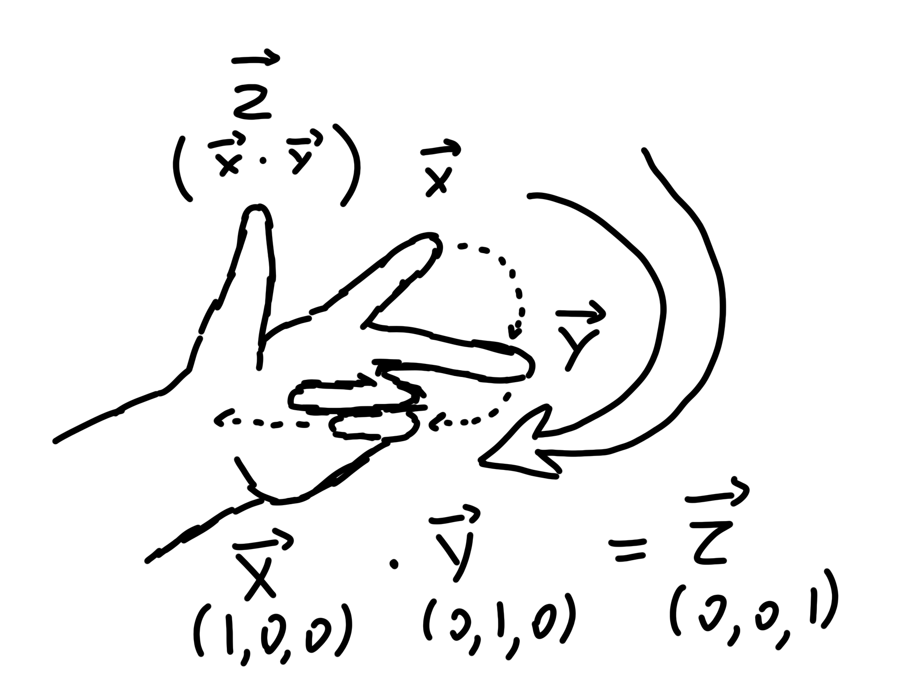

# Intro course

Разрабатывается механика бега по стене

## Опрделение столкновение со стенкой

Подписка на обработчик столкновения в `AWallRunCharacter::BeginPlay()`

```c++
GetCapsuleComponent()->OnComponentHit.AddDynamic(this, &AWallRunCharacter::OnPlayerCapsuleHit);
```

Функция обработки столкновения со стеной

```c++
bool bIsWallRunning = false;
EWallRunSide CurrentWallRunSide = EWallRunSide::None;
FVector CurrentWallRunDirection = FVector::ZeroVector;

void AWallRunCharacter::OnPlayerCapsuleHit(UPrimitiveComponent* HitComponent, AActor* OtherActor, UPrimitiveComponent* OtherComp, FVector NormalImpulse, const FHitResult& Hit)
{
	FVector HitNormal = Hit.ImpactNormal;

	if (bIsWallRunning) // провекра на то что уже бежим
		return;

	if (!IsSurfaceWallRunnable(HitNormal)) // проверка на возможность пройти по стене. Если это не пол то дальше
		return;

	if (!GetCharacterMovement()->IsFalling())
		return;

	EWallRunSide Side = EWallRunSide::None;
	FVector Direction = FVector::ZeroVector;
	GetWallSideAndDirection(HitNormal, Side, Direction);

	if (!AreRequiredKeysDown(Side))
		return;

	StartWallRun(Side, Direction);
}
```

`Hit.ImpactNormal` - нормаль вектора. Вектор перпендикулярный плоскости. Стоя на равной поверхности это: x: 0, y: 0, z: 1

## Фильтрация столкновений

Функция определяющая подходящую стену

```c++
bool AWallRunCharacter::IsSurfaceWallRunnable(const FVector& SurfaceNormal) const
{
	if (SurfaceNormal.Z > GetCharacterMovement()->GetWalkableFloorZ() || SurfaceNormal.Z < -0.005f)
		return false;

	return true;
}
```

`GetCharacterMovement()->GetWalkableFloorAngle()` - возвращает угол по которому можно ходить. Настраивается в редакторе и равен 44,7

Скалярное произведение векторов = Cos угла между ними. Чтобы получить угол на который игрок опирается надо сделать следующиее: умножить вектор-нормали на который игрок столкнулся HitNormal на единичный вектор-Z

```c++
float SlopeCosine = FVector::DotProduct(FVector::UpVector, HitNormal);
float SlopeAngle = FMath::RadiansToDegrees(FMath::Acos(SlopeCosine));
```

Однако, умножение в данном случае лишнее, так как в любом случае получим компонент-Z

```c++
float SlopeAngle = FMath::RadiansToDegrees(FMath::Acos(HitNormal.Z));
```

`SurfaceNormal.Z` пола = 1, стены = 0, если наклонена влево, то правая сторона положительная левая отрицательная

## Определение стороны столкновения

 `enum` описывающий сторон стен

 ```c++
UENUM()
enum class EWallRunSide : uint8
{
	None,
	Left,
	Right
};
 ```

Функция определяющая сторону

```c++
void AWallRunCharacter::GetWallSideAndDirection(const FVector HitNormal, EWallRunSide& OutSide, FVector& OutDirection) const
{
	if (FVector::DotProduct(HitNormal, GetActorRightVector()) > 0)
	{
		OutDirection = FVector::CrossProduct(HitNormal, FVector::UpVector).GetSafeNormal();
		OutSide = EWallRunSide::Left;
	}
	else
	{
		OutDirection = FVector::CrossProduct(FVector::UpVector, HitNormal).GetSafeNormal();
		OutSide = EWallRunSide::Right;
	}
}
```

Если ударится левым плечом, то вектор право стены и игрока будут смотреть враво положительно, если правым плечом, то вектор стены будет смотреть влевую сторону и при умножении будет отрицательное число

`CrossProduct` - получение нового вектора из результата векторного производения с тонко придуманными правилами. Чтобы получить нужное направление вектора надо использовать правило левой руки (если используется левая система векторов, если правая то правая).

В чем суть:

Большой палец левой руки указывает на направление нового вектора при умножении. Но чтобы правильно получить вектор надо использовать специальное направленное векторное умножение. Т.е. направление пальцев указывает направление умножения, а указательный и средний палец указывает на направление оставшихся двух векторов.



## Проверка на условие старта механики

Проверка на то, что персонаж уже бежит

```c++
	if (bIsWallRunning)
		return;
```

Проверка на подходящую стену

```c++
	if (!IsSurfaceWallRunnable(HitNormal))
		return;
```

Проверка на то, что персонаж должен падать перед касанием стены

```c++
	if (!GetCharacterMovement()->IsFalling())
		return;
```

Проверка на зажатие клавишь

```c++
	if (!AreRequiredKeysDown(Side))
		return;
```

Функция проверки зажатие клавишь

```c++
bool AWallRunCharacter::AreRequiredKeysDown(EWallRunSide Side) const
{
	if (ForwardAxis < 0.1f)
		return false;

	if (Side == EWallRunSide::Right && RightAxis < -0.1f) // если была нажата клавиша влево то прекратить
		return false;

	if (Side == EWallRunSide::Left && RightAxis > 0.1f) // если была нажата клавиша враво то прекратить
		return false;

	return true;
}
```

## Начало и окончание бега по стене

Функция начала

 ```c++
void AWallRunCharacter::StartWallRun(EWallRunSide Side, const FVector& Direction)
{
	BeginCameraTilt();

	bIsWallRunning = true;
	CurrentWallRunSide = Side;
	CurrentWallRunDirection = Direction;

	GetCharacterMovement()->SetPlaneConstraintNormal(FVector::UpVector); // задает перемещение только в ограниченной плоскости, в данном случае плоскость XY, плоскотсь задется в соответствии перпендикуляра вектора, здесь он задан перпендикуляр нормали Z

	GetWorld()->GetTimerManager().SetTimer(WallRunTimer, this, &AWallRunCharacter::StopWallRun, MaxWallRunTimer, false);
}
 ```

Функция окончания

```c++
void AWallRunCharacter::StopWallRun()
{
	EndCameraTilt();

	bIsWallRunning = false;

	GetCharacterMovement()->SetPlaneConstraintNormal(FVector::ZeroVector);
}
```

## Бег по стене

Бег по стене реализован в функции `AWallRunCharacter::Tick(float DeltaSeconds)`

```c++
void AWallRunCharacter::Tick(float DeltaSeconds)
{
	Super::Tick(DeltaSeconds);

	if (bIsWallRunning)
		UpdateWallRun();

	CameraTiltTimeline.TickTimeline(DeltaSeconds);
}
```

Основная функция реализовывающая логику бега по стене

```c++
void AWallRunCharacter::UpdateWallRun()
{
	if (!AreRequiredKeysDown(CurrentWallRunSide))
	{
		StopWallRun();
		return;
	}

	FHitResult HitResult;

	FVector LineTraceDirection = CurrentWallRunSide == EWallRunSide::Right ? GetActorRightVector() : -GetActorRightVector(); // если стена слева то пустить лучь влево: вектор -вправо
	float LineTraceLength = 200.0f;

	FVector StartPosition = GetActorLocation();
	FVector EndPostion = StartPosition + LineTraceLength * LineTraceDirection;

	FCollisionQueryParams QueryParams;
	QueryParams.AddIgnoredActor(this);

	if (GetWorld()->LineTraceSingleByChannel(HitResult, StartPosition, EndPostion, ECC_Visibility, QueryParams))
	{
		EWallRunSide Side = EWallRunSide::None;
		FVector Direction = FVector::ZeroVector;
		GetWallSideAndDirection(HitResult.ImpactNormal, Side, Direction);

		if (Side != CurrentWallRunSide)
			StopWallRun();
		else
		{
			CurrentWallRunDirection = Direction;
			GetCharacterMovement()->Velocity = GetCharacterMovement()->GetMaxSpeed() * CurrentWallRunDirection;
		}
	}
	else
	{
		StopWallRun();
	}

}
```

## Наклон камеры

```c++
void AWallRunCharacter::UpdateCameraTilt(float Value)
{
	FRotator CurrentControlRotation = GetControlRotation();
	CurrentControlRotation.Roll = CurrentWallRunSide == EWallRunSide::Left ? Value : -Value;
	GetController()->SetControlRotation(CurrentControlRotation);
}
```

## Отпрыгивание от стены

```c++
void AWallRunCharacter::Jump()
{
	if (bIsWallRunning)
	{
		FVector JumpDirection = FVector::ZeroVector;

		if(CurrentWallRunSide == EWallRunSide::Right)
		{
			JumpDirection = FVector::CrossProduct(CurrentWallRunDirection, FVector::UpVector).GetSafeNormal();
		}
		else
		{
			JumpDirection = FVector::CrossProduct(FVector::UpVector, CurrentWallRunDirection).GetSafeNormal();
		}

		JumpDirection += FVector::UpVector;

		LaunchCharacter(GetCharacterMovement()->JumpZVelocity * JumpDirection.GetSafeNormal(), false, true);
		StopWallRun();
	}
	else
	{
		Super::Jump();
	}
}
```